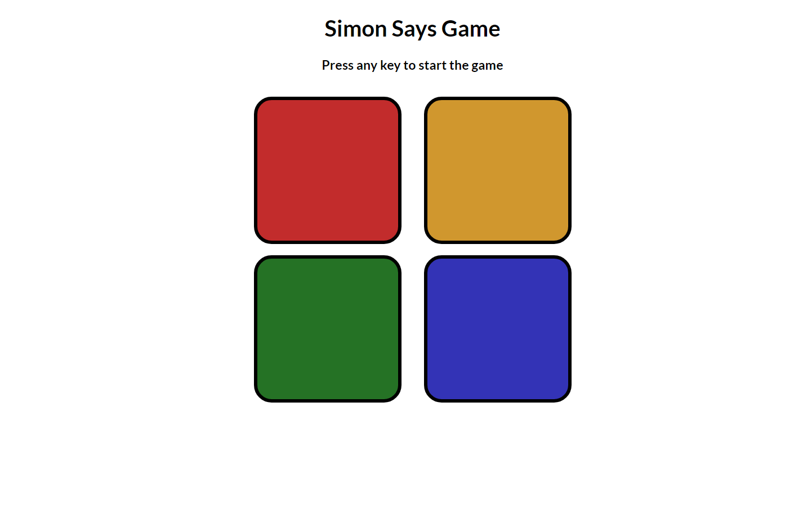

# Simon Says Game

## Table of contents

- [Overview](#overview)
  - [The challenge](#the-challenge)
  - [Screenshot](#screenshot)
  - [Links](#links)
- [My process](#my-process)
  - [Built with](#built-with)
- [Author](#author)

## Overview

### The Challenge

Create a Simon Says game using HTML, CSS, and JavaScript. The game should have a sequence of blinking colours which must be entered by the user in the correct order to successfully proceed to the next level. The game shall also display the final score and the highest score achieved in a run.

### Screenshot

### Links

- Solution URL: [Github Repo](https://github.com/Priyanshu-Prime/Simon-Says-Game)
- Live Site URL: [Game WebPage](https://priyanshu-prime.github.io/Simon-Says-Game/)

## My process

### Built with

- Semantic HTML5 markup
- CSS
- Javascript

## Author

- Website - [Priyanshu Makwana](https://www.linkedin.com/in/priyanshu-makwana-277b93261/)
